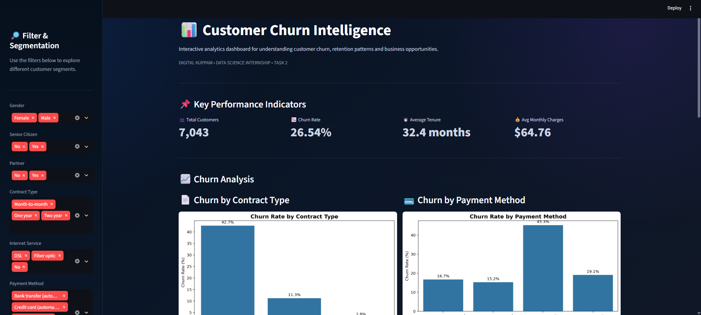

# 📊 Customer Churn Intelligence Dashboard

An interactive **Customer Churn Analytics Dashboard** developed using Python and Streamlit as part of the **Digital Kuppam Data Science Internship – Task 2**.

The dashboard helps analyze customer churn patterns, identify high-risk customer segments, and provide actionable business recommendations for improving customer retention.

---

## 📌 Project Overview

Customer churn is a major challenge for telecom companies because losing existing customers can negatively affect revenue, customer lifetime value, and long-term business growth.

This project analyzes telecom customer data to understand churn behavior across different customer characteristics, including:

- Contract Type
- Payment Method
- Internet Service
- Technical Support
- Customer Tenure
- Senior Citizen Status
- Gender
- Monthly Charges

An interactive Streamlit dashboard was developed to make the analysis easier to explore through filters, KPIs, visualizations, insights, and recommendations.

---

## 🎯 Project Objectives

The main objectives of this project are:

- Clean and prepare the customer churn dataset.
- Analyze customer churn patterns.
- Calculate important business KPIs.
- Visualize churn across different customer attributes.
- Provide interactive customer segmentation filters.
- Identify high-risk customer segments.
- Generate meaningful business insights.
- Provide actionable recommendations for customer retention.

---

## 📂 Dataset Description

The dataset contains telecom customer information with **7,043 customer records and 21 features**.

### Dataset Features

| Feature | Description |
|---|---|
| customerID | Unique customer identifier |
| gender | Customer gender |
| SeniorCitizen | Senior citizen status |
| Partner | Whether the customer has a partner |
| Dependents | Whether the customer has dependents |
| tenure | Number of months the customer has stayed |
| PhoneService | Phone service availability |
| MultipleLines | Multiple line service |
| InternetService | Type of internet service |
| OnlineSecurity | Online security service |
| OnlineBackup | Online backup service |
| DeviceProtection | Device protection service |
| TechSupport | Technical support service |
| StreamingTV | Streaming TV service |
| StreamingMovies | Streaming movies service |
| Contract | Contract type |
| PaperlessBilling | Paperless billing status |
| PaymentMethod | Payment method |
| MonthlyCharges | Monthly customer charges |
| TotalCharges | Total charges paid |
| Churn | Customer churn status |

---

## 📊 Dataset Summary

- **Total Customers:** 7,043
- **Total Features:** 21
- **Churned Customers:** 1,869
- **Overall Churn Rate:** 26.54%
- **Average Tenure:** 32.4 months
- **Average Monthly Charges:** $64.76

---

## 🧹 Data Preparation

The following data preparation steps were performed:

1. Loaded the dataset using Pandas.
2. Converted `MonthlyCharges` to numeric format.
3. Converted `TotalCharges` to numeric format.
4. Handled missing values in `TotalCharges`.
5. Filled the 11 blank `TotalCharges` values with `0`.
6. Cleaned text-based columns.
7. Checked for duplicate records.
8. Prepared the cleaned dataset for analysis and visualization.

The 11 customers with blank `TotalCharges` values were retained because these records correspond to customers with zero tenure.

---

## 📌 Key Performance Indicators

The dashboard displays the following important KPIs:

| KPI | Value |
|---|---:|
| 👥 Total Customers | **7,043** |
| 📉 Churn Rate | **26.54%** |
| ⏱️ Average Tenure | **32.4 months** |
| 💰 Average Monthly Charges | **$64.76** |

---

## 🎛️ Interactive Filters

The dashboard provides interactive filters that allow users to analyze specific customer segments.

### Available Filters

- Gender
- Senior Citizen
- Partner
- Contract Type
- Internet Service
- Payment Method
- Churn Status

The dashboard dynamically updates the displayed analysis according to the selected filters.

---

## 📈 Dashboard Visualizations

The dashboard includes several visualizations to understand customer churn patterns.

### 1. Churn by Contract Type

Compares churn rates across:

- Month-to-month
- One year
- Two year

### 2. Churn by Payment Method

Analyzes customer churn across different payment methods.

### 3. Churn by Internet Service

Compares churn rates among:

- DSL
- Fiber optic
- No internet service

### 4. Churn by Technical Support

Compares churn rates based on technical support availability.

### 5. Customer Distribution by Gender

Shows the distribution of customers by gender.

### 6. Churn by Senior Citizen Status

Compares churn behavior between senior and non-senior customers.

### 7. Churn by Tenure Group

Analyzes customer churn across different tenure ranges.

---

## 📸 Dashboard Preview

The following image shows a preview of the interactive Customer Churn Intelligence Dashboard.



---

## 🔍 Key Findings

### 1. Month-to-Month Customers Have the Highest Churn

Month-to-month customers have a churn rate of approximately **42.71%**, significantly higher than customers with longer-term contracts.

- Month-to-month: **42.71%**
- One year: **11.27%**
- Two year: **2.83%**

This indicates that contract duration is strongly associated with customer retention.

---

### 2. Electronic Check Customers Show High Churn

Customers using electronic checks have the highest churn rate among the payment methods.

- Electronic check: **45.29%**
- Mailed check: **19.11%**
- Bank transfer (automatic): **16.71%**
- Credit card (automatic): **15.24%**

---

### 3. Fiber Optic Customers Have Higher Churn

Fiber optic customers show a relatively high churn rate.

- Fiber optic: **41.89%**
- DSL: **18.96%**
- No internet service: **7.40%**

This segment may require further investigation into service quality, pricing, technical issues, and customer satisfaction.

---

### 4. New Customers Are More Likely to Churn

Customers with shorter tenure show significantly higher churn.

The **0–6 month** customer group has a churn rate of approximately **52.94%**, while customers with **49–72 months** of tenure have a churn rate of approximately **9.51%**.

This highlights the importance of customer onboarding and early engagement.

---

### 5. Technical Support Is an Important Retention Factor

Customers without technical support have a substantially higher churn rate than customers with technical support.

This suggests that improving customer assistance and technical support could contribute to better retention.

---

### 6. Churned Customers Have Higher Monthly Charges

The average monthly charges are higher for customers who churn.

- Churned customers: approximately **$74.44**
- Non-churned customers: approximately **$61.27**

This indicates that pricing and perceived customer value should be considered in retention strategies.

---

## 💡 5 Business Insights

### 🔴 Insight 1 — Month-to-Month Customers Are High Risk

Month-to-month customers have the highest churn rate at **42.71%**.

**Business implication:** These customers should receive targeted retention campaigns and incentives to move toward longer-term contracts.

---

### 🟠 Insight 2 — Early Tenure Customers Need Attention

Customers in their first few months have significantly higher churn rates.

**Business implication:** Improving onboarding and early customer engagement can help reduce early-stage churn.

---

### 🟡 Insight 3 — Electronic Check Customers Have Higher Churn

Electronic check users have the highest churn rate among payment methods at **45.29%**.

**Business implication:** The company should review the payment experience and encourage convenient automatic payment options.

---

### 🔵 Insight 4 — Technical Support Can Support Retention

Customers without technical support show considerably higher churn.

**Business implication:** Increasing awareness and adoption of technical support services may improve customer satisfaction and retention.

---

### 🟣 Insight 5 — Fiber Optic Customers Require Further Investigation

Fiber optic customers have a churn rate of **41.89%**.

**Business implication:** The company should investigate fiber service quality, pricing, technical complaints, and customer expectations.

---

## 🚀 Business Recommendations

### 1. Encourage Long-Term Contracts

Offer targeted discounts, loyalty benefits, and attractive contract conversion offers to month-to-month customers.

### 2. Improve New Customer Onboarding

Develop a structured onboarding program during the first few months of the customer relationship.

### 3. Promote Automatic Payment Methods

Encourage customers to use automatic bank transfer or credit card payments by highlighting convenience and providing suitable incentives.

### 4. Increase Technical Support Adoption

Promote technical support services and provide proactive assistance to customers experiencing technical problems.

### 5. Investigate Fiber Optic Customer Churn

Analyze fiber optic customer feedback, service quality, pricing, technical complaints, and customer satisfaction.

### 6. Use Customer Segmentation

Use dashboard filters and churn patterns to identify high-risk customer groups and design personalized retention campaigns.

---

## 🛠️ Technologies Used

- **Python**
- **Pandas**
- **Matplotlib**
- **Seaborn**
- **Streamlit**
- **GitHub**

---

## 📁 Project Structure

```text
customer-churn-prediction-dashboard/
│
├── images/
│   └── dashboard.png
│
├── report/
│   └── Customer_Churn_Analytics_Task_2_Report_Final.pdf
│
├── app.py
├── Dataset.csv
├── README.md
├── requirements.txt
└── .gitignore
